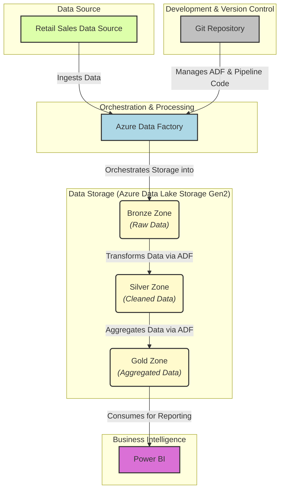
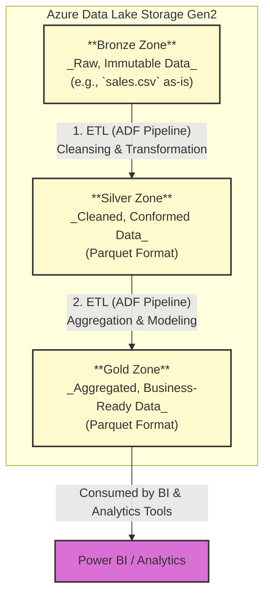
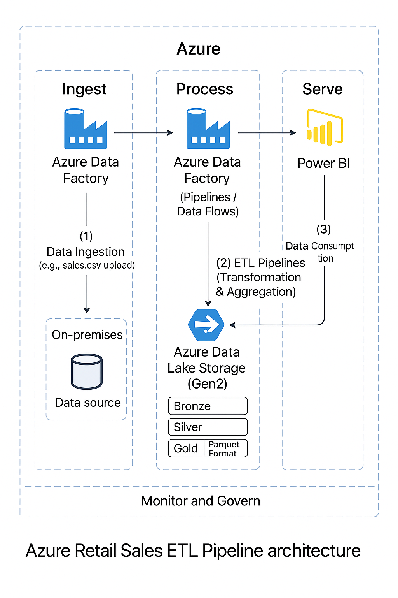

🏗️ End-to-End Azure Data Engineering Architecture
Use Case: Retail Sales ETL Pipeline with Lakehouse Design

## 🚀 Project Overview

This project implements a robust and scalable **End-to-End ETL (Extract, Transform, Load) pipeline** for retail sales data, leveraging Azure's powerful data engineering services. The primary goal is to ingest raw sales data, clean and transform it, and prepare aggregated insights for business intelligence and reporting.

---

## ✨ Features

* **Automated Data Ingestion:** Securely ingests raw sales data into a data lake.
* **Layered Data Architecture:** Implements a Medallion Architecture (Bronze, Silver, Gold) for data quality and reusability.
* **Data Transformation & Cleansing:** Handles data type conversions, null values, and derives new metrics.
* **Data Aggregation:** Prepares summarized data suitable for analytical reporting.
* **Cloud-Native & Scalable:** Built entirely on Azure, ensuring scalability and cost-effectiveness.
* **Version Controlled:** All pipeline definitions and code are managed via Git.
---
## 🏛️ High-Level Architecture

Below is a high-level overview of the pipeline's architecture, illustrating the main components and their interactions.


---
## Tech Stack

This project leverages the following Azure services and technologies:

Azure Data Factory (ADF): Used for orchestrating data pipelines, data ingestion, and transformations (Pipelines, Data Flows).

Azure Data Lake Storage Gen2 (ADLS Gen2): Serves as the central data lake with a structured Bronze, Silver, and Gold zone architecture.

Parquet Format: Optimized columnar storage format used for processed data in Silver and Gold layers.

Power BI: (To be integrated) The dashboard layer for visualizing aggregated business insights.

Git: Employed for robust source control and versioning of all code and pipeline definitions.

Python (Optional): Used for local data inspection and potential custom transformation scripts (though not extensively used in the main pipeline logic here).

---
## Data Pipeline Overview
The ETL pipeline follows a Medallion Architecture, progressing data through distinct quality zones:

🔹 Bronze Layer
Purpose: Raw, immutable ingestion.

Process: Raw sales.csv files uploaded from the source system are ingested directly via an ADF pipeline.

Storage: Stored as-is (raw format) in ADLS Gen2 under bronze/sales/.

🔸 Silver Layer
Purpose: Cleaned, conformed, and semi-processed data.

Process: An ADF pipeline reads data from the Bronze layer, applies cleaning rules (e.g., handling nulls, type conversions), and derives new columns (e.g., Profit = Sales - Cost).

Storage: Saved as Parquet format files in ADLS Gen2 under silver/sales_cleaned/.

🟡 Gold Layer
Purpose: Aggregated, business-ready data optimized for analytics.

Process: An ADF pipeline reads from the Silver layer, performs aggregations (e.g., sales summarized by region and date), and calculates key business-level metrics.

Storage: Stored as Parquet format files in ADLS Gen2 under gold/sales_summary/, ready for consumption by BI tools.

🏅 Medallion Architecture Detail
This diagram illustrates the flow of data through the Bronze, Silver, and Gold layers within Azure Data Lake Storage Gen2, representing the progressive refinement of data.


## 🏗 Architecture Diagram



```
## 🚀 Getting Started

This section will guide you through setting up and running the Azure Retail Sales ETL Pipeline.

### Prerequisites

Before you begin, ensure you have the following:

* An **Azure Subscription**
* **Azure CLI** or **Azure PowerShell** installed (recommended for resource provisioning)
* Access to the **Azure Portal**
* **Power BI Desktop** installed (for consuming the final data)
* **Git** installed on your local machine

### Deployment Steps

Follow these steps to deploy and run the pipeline in your Azure environment:

1.  **Clone the Repository:**
    Start by cloning this project repository to your local machine:
    ```bash
    git clone [https://github.com/pawand2002/azure-retail-data-pipeline.git](https://github.com/pawand2002/azure-retail-data-pipeline.git)
    cd azure-retail-data-pipeline
    ```

2.  **Azure Resource Setup:**
    You'll need to provision the core Azure services. You can do this via the Azure Portal or using Azure CLI/PowerShell for automation.

    * **Resource Group:**
        Create a new Azure Resource Group to contain all your project resources, or use an existing one.
        ```bash
        # Example using Azure CLI
        az group create --name [Your-Resource-Group-Name] --location [Your-Azure-Region]
        ```
        *(Replace `[Your-Resource-Group-Name]` and `[Your-Azure-Region]` with your desired values, e.g., `az group create --name RetailETL-RG --location eastus`)*

    * **Azure Data Lake Storage Gen2 (ADLS Gen2):**
        Create a new ADLS Gen2 storage account within your resource group. **Ensure "Hierarchical namespace" is enabled** during creation.
        ```bash
        # Example using Azure CLI
        az storage account create \
          --name [Your-Storage-Account-Name] \
          --resource-group [Your-Resource-Group-Name] \
          --location [Your-Azure-Region] \
          --sku Standard_LRS \
          --kind StorageV2 \
          --hns true
        ```
        *(Replace placeholders accordingly, e.g., `az storage account create --name retaildatalake --resource-group RetailETL-RG --location eastus --sku Standard_LRS --kind StorageV2 --hns true`)*

    * **Azure Data Factory (ADF):**
        Create a new Azure Data Factory instance.
        ```bash
        # Example using Azure CLI
        az datafactory create \
          --name [Your-ADF-Name] \
          --resource-group [Your-Resource-Group-Name] \
          --location [Your-Azure-Region]
        ```
        *(Replace placeholders, e.g., `az datafactory create --name RetailSalesADF --resource-group RetailETL-RG --location eastus`)*

3.  **Upload Raw Data:**
    * Locate the sample raw data file, `Superstore.csv`, in the `data/` directory of your cloned repository.
    * Upload this file to your ADLS Gen2 storage account. You'll need to create a container (e.g., `raw-data`) and a specific folder path within it (e.g., `sales/`) to match the expected input path for the Bronze layer.
        * **Expected Path Example:** `abfss://raw-data@[Your-Storage-Account-Name].dfs.core.windows.net/sales/Superstore.csv`

4.  **Deploy ADF Pipelines & Configure Linked Services:**
    * Open your Azure Data Factory Studio (you can find the link in the Azure Portal for your ADF instance).
    * **Create Linked Service:** Navigate to **Manage** -> **Linked services**. Create a new Linked Service for your ADLS Gen2, pointing it to your newly created storage account. Ensure the ADF Managed Identity has the necessary permissions (e.g., "Storage Blob Data Contributor" role on your ADLS Gen2 account).
    * **Import Pipelines:** Go to the **Author** section. You will need to import the pipeline definitions from the `adf-pipelines/` directory of this repository (e.g., `bronze_ingestion.json`, `silver_transform.json`, `gold_aggregation.json`). You can either:
        * Manually create new pipelines and copy-paste the JSON code into them.
        * Use more advanced ADF deployment methods (like ARM templates) if you prefer automation, though manual import is quicker for initial setup.
    * **Update Datasets/Activities:** Review and update any datasets or activities within the imported pipelines to ensure they correctly reference your newly created Linked Services and the precise paths within ADLS Gen2 (e.g., `raw-data/sales/` for input, `silver/sales_cleaned/` for silver output, `gold/sales_summary/` for gold output).
    * **Publish All:** After making changes, click the "Publish All" button in ADF Studio.

5.  **Trigger the Pipeline:**
    * Navigate to the main orchestration pipeline in the ADF Studio (e.g., the pipeline that sequences the bronze, silver, and gold stages).
    * Click "Add Trigger" -> "Trigger Now" to initiate the end-to-end ETL process.
    * Monitor the pipeline run in the "Monitor" section of ADF Studio to ensure successful completion. Look for green checkmarks indicating success!
```
```
## 📁 Project Structure

├── adf-pipelines/                # Azure Data Factory pipeline definitions (JSON)
│   ├── bronze_ingestion.json
│   ├── silver_transform.json
│   └── gold_aggregation.json
├── data/                         # Sample or test data (if applicable)
│   └── Superstore.csv                 # Raw sales data
├── powerbi-reports/              # Power BI Desktop files (.pbix)
│   └── retail_sales_dashboard.pb1x
├── notebooks/                    # Optional: Jupyter notebooks for data exploration/validation
│   └── data_validation.ipynb
└── README.md                     # This README file
---
