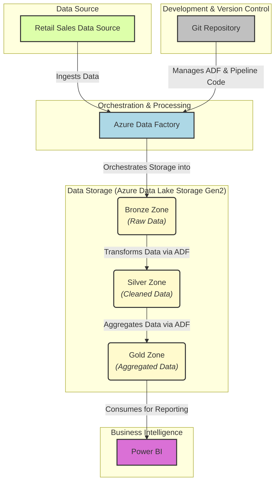
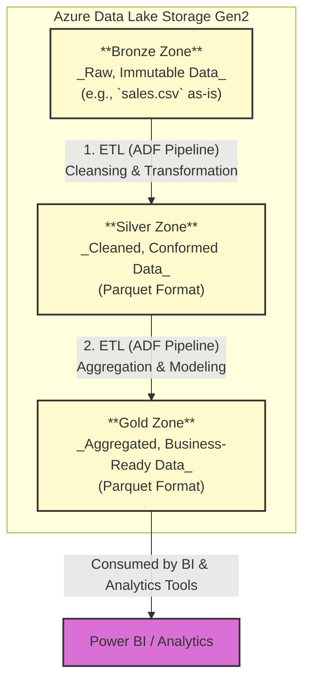

🏗️ End-to-End Azure Data Engineering Architecture
Use Case: Retail Sales ETL Pipeline with Lakehouse Design

## 🚀 Project Overview

This project implements a robust and scalable **End-to-End ETL (Extract, Transform, Load) pipeline** for retail sales data, leveraging Azure's powerful data engineering services. The primary goal is to ingest raw sales data, clean and transform it, and prepare aggregated insights for business intelligence and reporting.

---

## ✨ Features

* **Automated Data Ingestion:** Securely ingests raw sales data into a data lake.
* **Layered Data Architecture:** Implements a Medallion Architecture (Bronze, Silver, Gold) for data quality and reusability.
* **Data Transformation & Cleansing:** Handles data type conversions, null values, and derives new metrics.
* **Data Aggregation:** Prepares summarized data suitable for analytical reporting.
* **Cloud-Native & Scalable:** Built entirely on Azure, ensuring scalability and cost-effectiveness.
* **Version Controlled:** All pipeline definitions and code are managed via Git.

---
🧰 Tech Stack
| Layer | Tools / Technologies | 
| Ingestion & Orchestration | Azure Data Factory (Pipelines, Data Flows) | 
| Storage Zones | Azure Data Lake Storage Gen2 (Bronze → Silver → Gold) | 
| File Format | Parquet (optimized, columnar storage) | 
| Analytics & BI | Power BI (executive dashboards, RLS, DAX) – planned | 
| Source Control | Git (pipeline versioning) | 
| Optional Tools | Python (for offline inspection, not used in pipeline) | 

---
## 🏛️ High-Level Architecture

Below is a high-level overview of the pipeline's architecture, illustrating the main components and their interactions.

---
## Tech Stack

This project leverages the following Azure services and technologies:

Azure Data Factory (ADF): Used for orchestrating data pipelines, data ingestion, and transformations (Pipelines, Data Flows).

Azure Data Lake Storage Gen2 (ADLS Gen2): Serves as the central data lake with a structured Bronze, Silver, and Gold zone architecture.

Parquet Format: Optimized columnar storage format used for processed data in Silver and Gold layers.

Power BI: (To be integrated) The dashboard layer for visualizing aggregated business insights.

Git: Employed for robust source control and versioning of all code and pipeline definitions.

Python (Optional): Used for local data inspection and potential custom transformation scripts (though not extensively used in the main pipeline logic here).

---
## Data Pipeline Overview
The ETL pipeline follows a Medallion Architecture, progressing data through distinct quality zones:

🔹 Bronze Layer
Purpose: Raw, immutable ingestion.

Process: Raw sales.csv files uploaded from the source system are ingested directly via an ADF pipeline.

Storage: Stored as-is (raw format) in ADLS Gen2 under bronze/sales/.

🔸 Silver Layer
Purpose: Cleaned, conformed, and semi-processed data.

Process: An ADF pipeline reads data from the Bronze layer, applies cleaning rules (e.g., handling nulls, type conversions), and derives new columns (e.g., Profit = Sales - Cost).

Storage: Saved as Parquet format files in ADLS Gen2 under silver/sales_cleaned/.

🟡 Gold Layer
Purpose: Aggregated, business-ready data optimized for analytics.

Process: An ADF pipeline reads from the Silver layer, performs aggregations (e.g., sales summarized by region and date), and calculates key business-level metrics.

Storage: Stored as Parquet format files in ADLS Gen2 under gold/sales_summary/, ready for consumption by BI tools.

🏅 Medallion Architecture Detail
This diagram illustrates the flow of data through the Bronze, Silver, and Gold layers within Azure Data Lake Storage Gen2, representing the progressive refinement of data.

##  Project Structure

├── adf-pipelines/                # Azure Data Factory pipeline definitions (JSON)
│   ├── bronze_ingestion.json
│   ├── silver_transform.json
│   └── gold_aggregation.json
├── data/                         # Sample or test data (if applicable)
│   └── sales.csv                 # Raw sales data
├── powerbi-reports/              # Power BI Desktop files (.pbix)
│   └── retail_sales_dashboard.pbix
├── notebooks/                    # Optional: Jupyter notebooks for data exploration/validation
│   └── data_validation.ipynb
└── README.md                     # This README file
